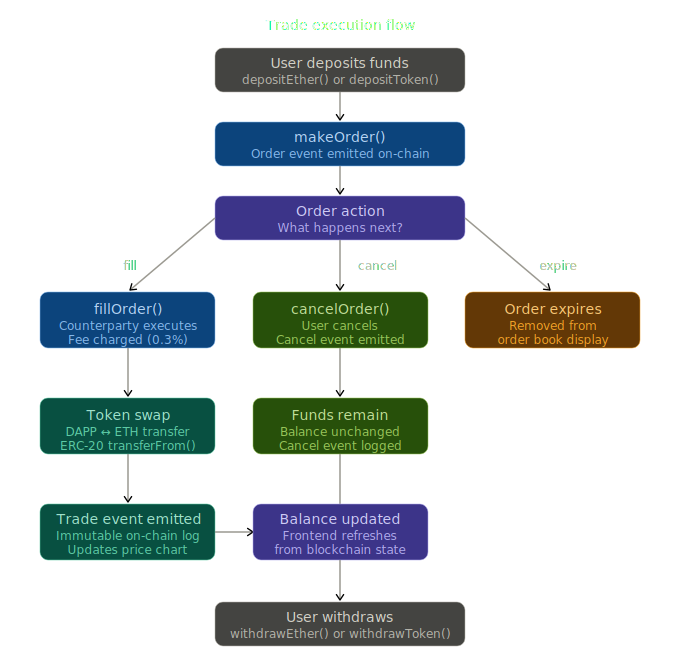

# Jake Kantor's Decentralized Cryptocurrency Exchange

A fully functional decentralized cryptocurrency exchange built on Ethereum. Trade DAPP tokens for ETH directly on-chain — no central authority, no custodian, no middleman.

**Author:** Jake Kantor  
**GitHub:** [github.com/kantorkid](https://github.com/kantorkid)  
**Demo:** [YouTube Walkthrough](https://youtu.be/E39Rr1eTVlo)  
**Contact:** jake.t.kantor@gmail.com

---

## System Architecture



The full stack spans a React frontend, two Solidity smart contracts, the Ethereum blockchain, and IPFS for decentralized file storage.

---

## Trade Execution Flow



Users deposit funds, place orders, and either fill, cancel, or let orders expire — all executed on-chain with immutable event logging.

---

## Overview

Traditional exchanges rely on centralized order books, custodial wallets, and trusted intermediaries. This project eliminates all three:

- **Non-custodial** — users hold their own keys, funds never leave their control until a trade executes
- **On-chain order book** — every order, cancellation, and trade is a blockchain transaction
- **Trustless settlement** — smart contracts execute trades atomically with no counterparty risk
- **Immutable history** — all trades are permanently logged on the Ethereum blockchain
- **Decentralized hosting** — frontend served via IPFS

---

## Features

### Exchange
- Deposit and withdraw ETH and DAPP tokens
- Place buy and sell orders
- Fill orders from the order book
- Cancel open orders
- Real-time order book display
- Live price chart (DAPP/ETH)
- Full trade history

### Smart Contracts
- ERC-20 compliant DAPP token
- Exchange contract with fee mechanism
- On-chain order matching
- Event-driven state updates

### Frontend
- React single-page application
- MetaMask wallet integration
- Real-time blockchain data via Web3.js
- Kovan testnet deployment

---

## Smart Contracts

### Exchange.sol

The core exchange contract handles all trading logic.

| Function | Description |
|----------|-------------|
| `depositEther()` | Deposit ETH into the exchange |
| `withdrawEther()` | Withdraw ETH from the exchange |
| `depositToken(address, uint)` | Deposit ERC-20 tokens |
| `withdrawToken(address, uint)` | Withdraw ERC-20 tokens |
| `makeOrder(address, uint, address, uint)` | Place a new order |
| `cancelOrder(uint)` | Cancel an open order |
| `fillOrder(uint)` | Execute a trade against an existing order |

### DappToken.sol

Standard ERC-20 token used as the exchange's trading pair against ETH.

| Function | Description |
|----------|-------------|
| `transfer(address, uint)` | Transfer tokens |
| `approve(address, uint)` | Approve spender |
| `transferFrom(address, address, uint)` | Execute approved transfer |

### Fee Structure

A 0.3% fee is charged on filled orders, paid to the exchange fee account. This mirrors the fee model used by Uniswap v1.

---

## Technology Stack

| Category | Technology |
|----------|-----------|
| Frontend | React · Create React App |
| Blockchain interaction | Web3.js |
| Wallet | MetaMask |
| Smart contracts | Solidity |
| Development framework | Truffle |
| Test network | Kovan testnet |
| Decentralized storage | IPFS |
| Block explorer | Etherscan |

---

## Project Structure

```
Jake-Kantor_Decentralized-Cryptocurrency_Exchange/
├── src/
│   ├── components/
│   │   ├── App.js
│   │   ├── Navbar.js
│   │   ├── Balance.js
│   │   ├── NewOrder.js
│   │   ├── OrderBook.js
│   │   ├── PriceChart.js
│   │   ├── Trades.js
│   │   └── MyTransactions.js
│   ├── store/
│   │   ├── actions.js
│   │   ├── reducers.js
│   │   └── selectors.js
│   └── contracts/
│       ├── Exchange.sol
│       └── DappToken.sol
├── docs/
│   ├── dex_system_architecture.svg
│   └── dex_trade_flow.svg
├── public/
├── migrations/
├── test/
└── README.md
```

---

## Installation

```bash
git clone https://github.com/kantorkid/Jake-Kantor_Decentralized-Cryptocurrency_Exchange.git
cd Jake-Kantor_Decentralized-Cryptocurrency_Exchange
npm install
```

---

## Running Locally

### Start the app

```bash
npm start
```

Open `http://localhost:3000`

### MetaMask configuration

1. Install MetaMask browser extension
2. Connect to Kovan testnet
3. Get free test ETH from a Kovan faucet
4. Import the DAPP token contract address

---

## Deployment

```bash
npm run build
```

Builds the production bundle to the `build/` folder. Deploy to IPFS for decentralized hosting.

---

## Testing

```bash
npm test
```

Runs the test suite in interactive watch mode.

---

## How It Works

### Placing an order

1. User deposits ETH or DAPP tokens into the exchange contract
2. User submits a buy or sell order via the frontend
3. `makeOrder()` is called — an `Order` event is emitted on-chain
4. The order appears in the order book for all users

### Filling an order

1. A counterparty clicks fill on an open order
2. `fillOrder()` is called
3. Smart contract validates both parties have sufficient balances
4. Tokens and ETH are atomically swapped
5. 0.3% fee is deducted
6. `Trade` event is emitted — updates price chart and trade history

### Cancelling an order

1. The original order creator clicks cancel
2. `cancelOrder()` is called
3. Order is marked cancelled on-chain
4. `Cancel` event is emitted — order disappears from order book
5. User's funds remain in the exchange for future trades or withdrawal

---

## Key Design Decisions

**On-chain order book** — most DEXes use off-chain order books for performance. This implementation keeps everything on-chain for maximum transparency and decentralization, accepting the gas cost tradeoff.

**Atomic settlement** — trades execute in a single transaction. Either both sides of the trade complete or neither does — no partial fills or settlement risk.

**Non-custodial architecture** — the exchange contract holds funds only while they are deposited. Users can withdraw at any time. No admin key can freeze or seize funds.

**Event-driven frontend** — the React app subscribes to blockchain events rather than polling. Order book and trade history update in real time as on-chain state changes.

---

## Future Enhancements

- ERC-20 to ERC-20 trading pairs beyond DAPP/ETH
- Liquidity pool model (Uniswap v2 style)
- Layer 2 deployment for lower gas costs
- Mobile-responsive UI
- Price oracle integration
- Mainnet deployment

---

## Demo

Watch the full walkthrough: [YouTube Demo](https://www.youtube.com/@jakekantor)

Contract verified on Etherscan: Kovan testnet

---

## License

MIT
